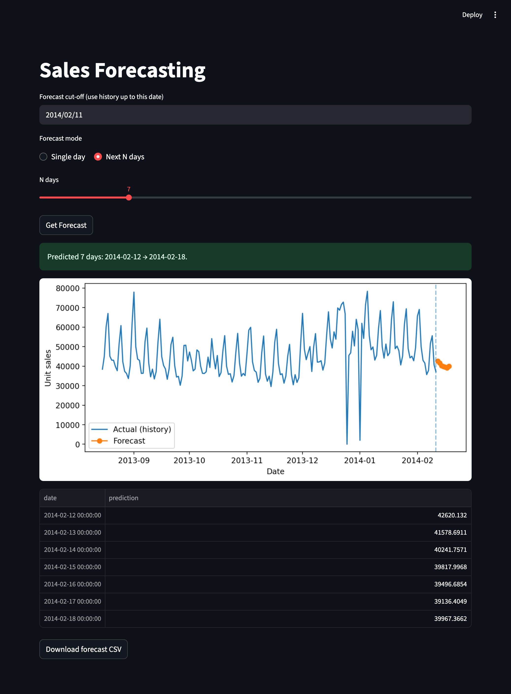

# Retail Demand Analysis - Masterschool

</img>
WIP!

## Purpose

This project forecasts retail demand using time series analysis.
It includes an XGBoost and LSTM model, a Streamlit app for interactive, visual demand forecasting and several Jupyter notebooks used for data preparation, EDA, and training the models.

## How to run

```bash
pip install -r requirements.txt
streamlit run app/main.py
```

Open http://localhost:8501 in your browser.